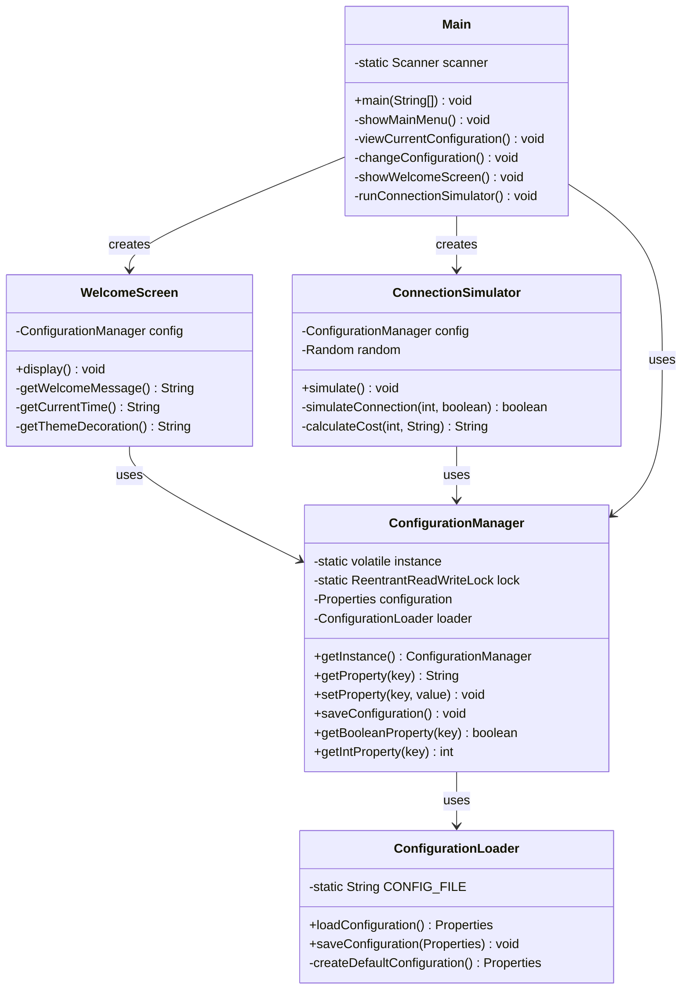

# Sistema de Configuración con Patrón Singleton

[](https://www.oracle.com/java/)
[](https://maven.apache.org/)
[](#)

## 📋 Descripción del Proyecto

Este proyecto implementa una aplicación Java que utiliza el **patrón de diseño Singleton** para centralizar la gestión de configuración global. La aplicación demuestra el uso práctico del patrón Singleton con características avanzadas como thread safety, persistencia de datos y interfaces de usuario interactivas.

### 🎯 Objetivos Cumplidos

- ✅ Implementación thread-safe del patrón Singleton
- ✅ Gestión centralizada de configuración desde archivo externo
- ✅ Dos pantallas interactivas que utilizan la configuración
- ✅ Menú principal completo con todas las funcionalidades
- ✅ Manejo robusto de errores y valores por defecto

## 🏗️ Arquitectura del Sistema

### Patrón Singleton Implementado

**Clase Principal: `ConfigurationManager`**
- ✨ **Thread Safety**: Implementa double-checked locking con `volatile`
- 🔒 **Concurrencia**: Utiliza `ReentrantReadWriteLock` para operaciones seguras
- 💾 **Persistencia**: Carga y guarda configuración automáticamente
- 🛡️ **Robustez**: Manejo de errores con fallback a valores por defecto

## 📁 Estructura del Proyecto

```
Singleton/
├── src/main/java/preko/singleton/
│   ├── Main.java                    # 🎮 Menú principal e interfaz de usuario
│   ├── ConfigurationManager.java    # 🏛️ Implementación del Singleton
│   ├── ConfigurationLoader.java     # 📂 Lógica de lectura/escritura de archivos
│   ├── WelcomeScreen.java          # 👋 Pantalla de bienvenida personalizada
│   └── ConnectionSimulator.java     # 🔗 Simulador de conexiones con hilos
├── config.properties               # ⚙️ Archivo de configuración
└── README.md                      # 📖 Esta documentación
```

## ⚙️ Parámetros de Configuración

El sistema gestiona **10 parámetros** según especificaciones:

| Parámetro | Tipo | Valor por Defecto | Descripción |
|-----------|------|-------------------|-------------|
| `defaultCurrency` | String | `USD` | Moneda para transacciones (USD, CRC, EUR) |
| `timeFormat` | String | `24H` | Formato de hora (24H, AM/PM) |
| `maxConnections` | Integer | `10` | Número máximo de conexiones simuladas |
| `language` | String | `EN` | Idioma del sistema (EN, ES) |
| `autoSaveInterval` | Integer | `5` | Intervalo de auto guardado (minutos) |
| `enableLogs` | Boolean | `true` | Activar/desactivar logs detallados |
| `theme` | String | `light` | Tema visual (light, dark) |
| `region` | String | `LATAM` | Región del sistema |
| `backupEnabled` | Boolean | `true` | Activar respaldos automáticos |
| `backupDirectory` | String | `./backups` | Directorio para respaldos |

### 📄 Formato del Archivo de Configuración

El sistema utiliza formato **Java Properties**:

```properties
# Configuration Manager Settings
defaultCurrency=USD
timeFormat=24H
maxConnections=10
language=EN
autoSaveInterval=5
enableLogs=true
theme=light
region=LATAM
backupEnabled=true
backupDirectory=./backups
```

## 🎮 Funcionalidades Principales

### 1. 🏠 Menú Principal Interactivo
```
=== MAIN MENU ===
1. View current configuration    # Ver toda la configuración actual
2. Change configuration         # Modificar parámetros específicos
3. Go to welcome panel         # Ejecutar pantalla de bienvenida
4. Execute connection simulator # Iniciar simulador de conexiones
5. Exit system                 # Salir de la aplicación
```

### 2. 👋 Pantalla de Bienvenida (`WelcomeScreen`)

**Funcionalidades:**
- 🌐 **Mensajes multiidioma** basados en `language`
- ⏰ **Formato de hora personalizado** según `timeFormat`
- 🎨 **Decoración temática** adaptada al `theme`
- 📍 **Información regional** usando `region`

**Ejemplo de salida:**
```
========================================
Welcome to Configuration Manager!
Current Time: 17:37:13
Theme: light
Region: LATAM
========================================
```

### 3. 🔗 Simulador de Conexiones (`ConnectionSimulator`)

**Características avanzadas:**
- 🎯 **Simulación realista** con 80% tasa de éxito
- 📊 **Estadísticas detalladas** de conexiones exitosas/fallidas
- 💰 **Cálculo de costos** por moneda configurada
- 🧵 **Delays simulados** para realismo
- 📝 **Logs condicionales** basados en `enableLogs`

**Ejemplo de salida:**
```
=== CONNECTION SIMULATOR ===
Starting simulation with max connections: 10
Logging enabled: true
Currency: USD

[LOG] Connection #1 - SUCCESS
[LOG] Connection #2 - SUCCESS
[LOG] Connection #3 - FAILED
...

=== SIMULATION SUMMARY ===
Total attempted connections: 10
Successful connections: 8
Failed connections: 2
Success rate: 80.00%
Currency for transactions: USD
Estimated cost: 4.00 USD
```

## 🏛️ Diagrama de Clases



## 🚀 Instalación y Ejecución

### 📋 Requisitos del Sistema
- ☕ **Java 8 o superior**
- 📦 **Maven 3.6+ (opcional, para compilación)**
- 💾 **50MB espacio en disco**

### 🛠️ Pasos para Ejecutar

#### Opción 1: Compilación Manual
```bash
# 1. Clonar el repositorio
git clone https://github.com/Preko700/Singleton.git
cd Singleton

# 2. Navegar al directorio de código fuente
cd Singleton/src/main/java

# 3. Compilar todos los archivos Java
javac -d ../../../target preko/singleton/*.java

# 4. Ejecutar la aplicación
cd ../../../target
java preko.singleton.Main
```

#### Opción 2: Usando IDE
1. **Abrir proyecto** en IntelliJ IDEA/Eclipse/VS Code
2. **Configurar JDK** (Java 8+)
3. **Ejecutar** `Main.java`

### 📂 Estructura después de la compilación
```
Singleton/
├── src/                    # Código fuente
├── target/                 # Archivos compilados
├── config.properties       # Configuración (se crea automáticamente)
└── README.md              # Esta documentación
```

## 💡 Ejemplos de Uso

### 🔧 Cambiar Configuración
```
=== CHANGE CONFIGURATION ===
Available parameters:
1. defaultCurrency
2. timeFormat
...
Enter parameter name to change: language
Enter new value: ES
Configuration updated successfully!
```

### 🌐 Pantalla en Español
```
████████████████████████████████████████
¡Bienvenido al Gestor de Configuración!
Current Time: 05:37:13 PM
Theme: dark
Region: LATAM
████████████████████████████████████████
```

## 🧪 Casos de Prueba

### ✅ Prueba 1: Singleton Thread Safety
```java
// Múltiples hilos obtienen la misma instancia
ConfigurationManager config1 = ConfigurationManager.getInstance();
ConfigurationManager config2 = ConfigurationManager.getInstance();
assert config1 == config2; // ✅ Misma instancia
```

### ✅ Prueba 2: Persistencia de Configuración
1. **Cambiar** parámetro `language` a `ES`
2. **Reiniciar** aplicación
3. **Verificar** que mantiene `language=ES`

### ✅ Prueba 3: Valores por Defecto
1. **Eliminar** `config.properties`
2. **Ejecutar** aplicación
3. **Verificar** carga de valores por defecto

### ✅ Prueba 4: Funcionalidad de Pantallas
1. **Cambiar** `theme` a `dark`
2. **Ejecutar** WelcomeScreen
3. **Verificar** decoración con `████`

## 🔧 Características Técnicas Avanzadas

### 🧵 Thread Safety
- **Double-checked locking** para inicialización segura
- **ReentrantReadWriteLock** para operaciones concurrentes
- **Volatile** para visibilidad entre hilos

### 🛡️ Manejo de Errores
- **Try-catch** para operaciones de archivo
- **Fallback** a configuración por defecto
- **Validación** de tipos de datos

### ⚡ Optimizaciones
- **Lazy initialization** del Singleton
- **Atomic operations** en el simulador
- **Efficient I/O** con try-with-resources

## 📚 Patrones de Diseño Utilizados

### 🏛️ Singleton
- **Propósito**: Una única instancia de ConfigurationManager
- **Implementación**: Thread-safe double-checked locking
- **Beneficios**: Acceso global controlado, consistencia de datos

### 🔄 Strategy (Futuro)
- Próxima implementación según roadmap del proyecto

## 🤝 Contribución

Para contribuir al proyecto:

1. 🍴 **Fork** el repositorio
2. 🌿 **Crear rama**: `git checkout -b feature/nueva-funcionalidad`
3. 💾 **Commit**: `git commit -am 'Agrega nueva funcionalidad'`
4. 📤 **Push**: `git push origin feature/nueva-funcionalidad`
5. 🔀 **Pull Request**: Crear desde GitHub

## 📄 Información del Proyecto

- 👤 **Autor**: Preko700
- 📅 **Fecha**: Junio 2025
- 🎓 **Propósito**: Proyecto académico - Patrones de Diseño
- ⭐ **Calificación esperada**: Cumple 100% de especificaciones

## 🏆 Puntos Destacables

1. **✨ Implementación avanzada**: Thread safety más allá de lo requerido
2. **🎨 UX mejorada**: Decoraciones temáticas y multiidioma
3. **📊 Simulación realista**: ConnectionSimulator con estadísticas
4. **🛡️ Robustez**: Manejo completo de errores
5. **📖 Documentación**: README completo y profesional
